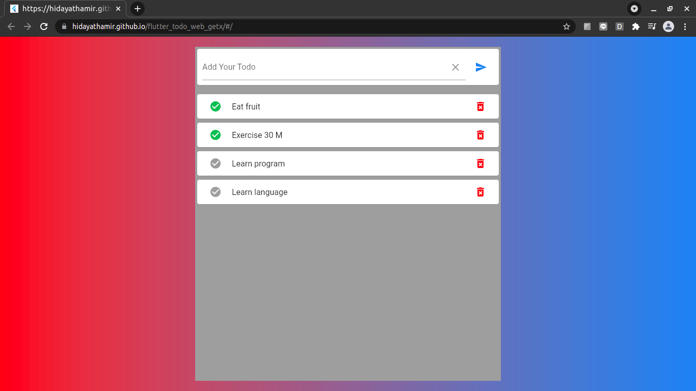
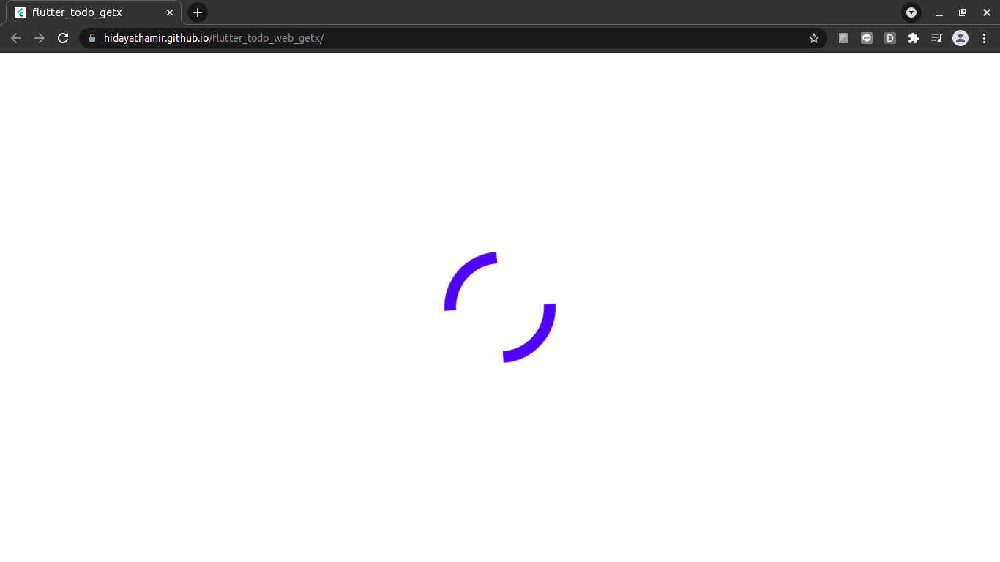
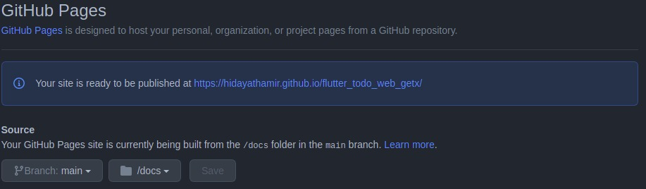

# flutter_todo_getx

### Live on : [hidayathamir.github.io/flutter_todo_web_getx/](https://hidayathamir.github.io/flutter_todo_web_getx/)

### **Home page**

we can add todo, remove todo, change status todo (done, undone).

<br>

### **Spinner**
Flutter web need a little bit more time to initiate, Show spinner while load the web so user will know the web is working.



<details>
  <summary>Add this div to web/index.html below body opening tag</summary>
  
  ```
  <div class="loading">
    <div class="loader"></div>
  </div>
  ```
</details>

<details>
  <summary>Add this style to web/index.html above head closing tag</summary>

  ```
  <!-- spinner when init web -->
  <style>
    .loading {
      display: flex;
      justify-content: center;
      align-items: center;
      margin: 0;
      position: absolute;
      top: 50%;
      left: 50%;
      -ms-transform: translate(-50%, -50%);
      transform: translate(-50%, -50%);
    }
    
    .loader {
      border: 16px solid #f3f3f3;
      border-radius: 50%;
      border: 15px solid ;
      border-top: 16px solid blue;
      border-right: 16px solid white;
      border-bottom: 16px solid blue;
      border-left: 16px solid white;
      width: 120px;
      height: 120px;
      -webkit-animation: spin 2s linear infinite;
      animation: spin 2s linear infinite;
    }
    
    @-webkit-keyframes spin {
      0% {
        -webkit-transform: rotate(0deg);
      }
      100% {
        -webkit-transform: rotate(360deg);
      }
    }
    
    @keyframes spin {
      0% {
        transform: rotate(0deg);
      }
      100% {
        transform: rotate(360deg);
      }
    }
  </style>
  ```
</details>

<br>

### **Base**
Flutter default project base is `<base href="/">` so we need to change according to github pages url `<base href="/(repo-name)/">`. in `web/index.html` change from `<base href="/">` to `<base href="/flutter_todo_web_getx/">`.

<br>

### **Build**
`flutter build web --release`.

<br>

### **Docs folder**
In root folder create new folder `docs/`. Github pages need this folder to live, copy all file in `build/web/` to `docs/`. Then in github `settings > github pages > source` chose main for branch and chose /docs for the folder.

If it's says "Your site is published at" that mean your Flutter web is live.